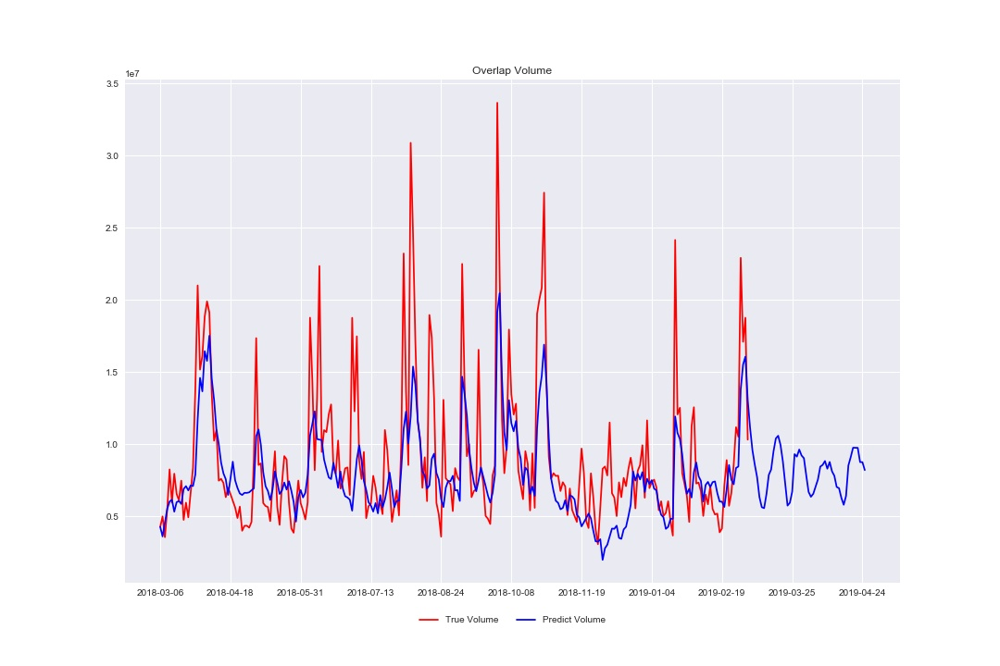

# Stock-Price-Prediction-Using-Deep-Learning

This project is describe about how to use Recurrent Neural Network to predict stock market price.

I've used Long Short Term Memory(LSTM) as a type of Recurrent Neural Network.

I used a single hidden layer network of LSTM's.

The internal architecture of LSTM is look like:

## Dataset

The dataset used in this project is Tesla stocks history (From 2018-03-06 - To 2019-03-06). 

I have downloaded this dataset from <a href ="https://www.nasdaq.com">NASDAQ</a>,  the *csv* file is present inside the data folder. 

Name of the csv file is **tsla.csv**.

## Architecture of Network

1. We construct a Recurrent Neural Network with having 6 dimension input. 

2. Network have one hidden layer.

3. The hidden layer consist of 128 numbers of LSTM units. 

4. LSTM layer is connected with one dense layer wtih only one neuron which will predicts the stock price to the given numbers of future days.

The architecture of our model is like:

## Steps implemented in a model

  ### 1.  Perform preprocessing of data
  
        
   &nbsp;&nbsp;&nbsp;&nbsp;&nbsp;In this phase we apply Min-Max scaling to avoid scale variations of features.It makes all the data points lies between 0 and 1.
        
   
       

  ### 2.  Data splitting based on Timestamp
  
        
   &nbsp;&nbsp;&nbsp;&nbsp;&nbsp;In this phase we split all the data points based on the timestamp.Our network takes splitted data points as input.
         
   
       

  ### 3.  Creating  a LSTM model to predict future stock price
        
  
   &nbsp;&nbsp;&nbsp;&nbsp;&nbsp;In this phase we crate a LSTM class, the network takes all the parameters and then trained on input.
         
   
       

  ### 4.  Training the regression model
        
   &nbsp;&nbsp;&nbsp;&nbsp;&nbsp;In this phase we train a LSTM network for 500 epochs, at every 100-th epoch we will get average Mean Squared Error.
        
   
       

  ### 5.  Predicting future stock price for a given number of days
        
   &nbsp;&nbsp;&nbsp;&nbsp;&nbsp;In this phase we predict the future stock price by using trained network.
        
   
        

## Screenshots

  #### 1. Actual Open Vs Predicted Open
   
     
     
  #### 2. Actual Close Vs Predicted Close
   
     
  
  #### 3. Actual Low Vs Predicted Low
   
    
  
  #### 4. Actual High Vs Predicted High
   
     
  
  #### 5. Actual Adj_Close Vs Predicted Adj_Close
   
     
  
  #### 6. Actual Volume Vs Predicted Volume
   
     
     

## Install

### &nbsp;&nbsp;&nbsp; Supported Python version
&nbsp;&nbsp;&nbsp;&nbsp;&nbsp;&nbsp;&nbsp;&nbsp;&nbsp;- Python version used in this project: 3.6.5

### &nbsp;&nbsp;&nbsp; Libraries used

> *  [Pandas](https://pypi.org/project/pandas/) 0.25.1
> *  [Numpy](https://pypi.org/project/numpy/) 1.16.2
> *  [Matplotlib](https://pypi.org/project/matplotlib/) 3.1.1
> *  [Scikit-learn](https://pypi.org/project/sklearn/) 0.21.3
> *  [TensorFlow](https://www.tensorflow.org) 1.9.0
> *  [Seaborn](https://pypi.org/project/tensorflow/) 0.8.1

## Code

This project has implementations of stock price prediction using LSTM which is done by using Tensorflow built-in RNN functions.

This implementation can be found inside `tsla_lstm.ipynb`.

## Run

To run this project you will need some software, like Anaconda, which provides support for running .ipynb files (Jupyter Notebook).

After making sure you have that, you can run from a terminal or cmd next lines:

`ipython notebook tsla_lstm.ipynb`

or

`jupyter notebook tsla_lstm.ipynb`

## For more details

Please visit my post on Medium <a href="https://medium.com/@karthickprogrammer22/stock-price-prediction-using-deep-learning-28f762981896">Stock Price Prediction Using Deep Learning</a>

